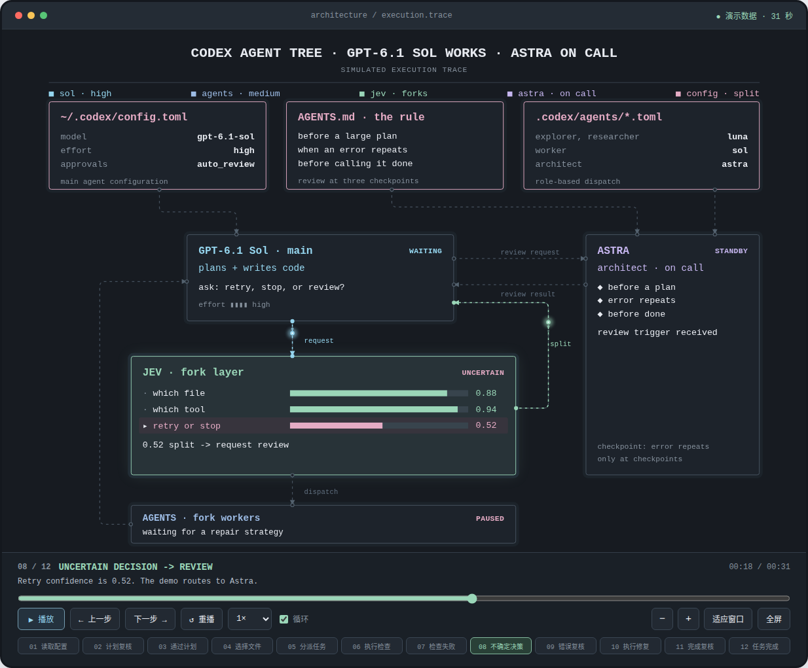

# animate-architecture

终端风格动态架构图的 Codex skill。用深色窗口、等宽文字、SVG 连线和沿路径移动的光点，展示系统组件之间的调用及当前操作。支持离线 HTML、播放/暂停、单步、拖动进度、倍速、缩放和全屏；GIF 为可选预览。

`skills/animate-architecture/` 是完整可移植的 skill。节点、连接、状态和时间线用 JSON 配置，不绑定 Agent 或特定模型。构建使用 Python 标准库，生成的 HTML 无网络依赖。



## 本地安装与调用

```bash
python3 scripts/install.py
```

默认安装到 `${CODEX_HOME:-~/.codex}/skills/animate-architecture`，已有副本先保存到 `skill-backups/`。新建 Codex 会话加载新 skill，然后输入：

> 使用 $animate-architecture，把我的订单处理系统画成终端风格动态图。组件包括客户端、订单服务、支付、事件队列和仓库。演示从提交订单到支付确认、发布事件和仓库履约的过程，给我可离线播放的 HTML。

已有真实架构时提供其组件、职责、调用关系与典型场景即可。skill 默认可以自动匹配相关制图任务。

## 直接运行模板

```bash
python3 skills/animate-architecture/scripts/build.py skills/animate-architecture/assets/agent-tree.json --output dist/agent-tree.html
python3 skills/animate-architecture/scripts/build.py skills/animate-architecture/assets/order-flow.json --output dist/order-flow.html
python3 skills/animate-architecture/scripts/build.py skills/animate-architecture/assets/hub-feedback.json --output dist/hub-feedback.html --verify
```

双击生成的 HTML。`examples/` 保留三个模拟案例：Agent 协作（7 节点、9 连线、12 步、31 秒）、订单处理（5 节点、6 连线、6 步、14 秒）、中心协调与反馈（5 节点、8 连线、4 步、12 秒）。不调用真实模型、支付接口或业务服务。

修改自己的 `diagram.json`，参考 [数据格式](skills/animate-architecture/references/diagram-format.md) 和 [设计规则](skills/animate-architecture/references/design-and-validation.md)。改变拓扑时重新安排框边端口与绕线路径。代码不包含自动布局或拖拽编辑器。

## 验证与 GIF

```bash
python3 -m unittest discover -s tests
python3 -m unittest discover -s skills/animate-architecture/scripts -p 'test_*.py'
python3 skills/animate-architecture/scripts/verify_browser.py --doctor
python3 skills/animate-architecture/scripts/verify_browser.py dist/agent-tree.html --output-dir dist/preview --preview-step 8
```

默认复用已安装的 `agent-browser`；没有该 CLI 时使用当前 Python 环境中的 Playwright。检查所有阶段，但默认只保存代表图与小屏图；`--all-steps` 才额外保存每阶段截图。浏览器阻断外部请求，不使用个人浏览器资料，验收失败不会换后端重试。

GIF 使用 Playwright 和 Pillow；按 [独立环境安装说明](skills/animate-architecture/references/browser-setup.md) 安装固定版本，再用虚拟环境的 Python 执行验证器并加 `--gif`。自动复用现有 Chrome，Linux 和 Mac 均有路径识别；不要求另装 Chromium，也不会自动下载浏览器。播放 HTML 不需要这些包。

2026-10-08 已在 Linux 用现有 Chrome 实跑两个后端和 GIF；报告见 `examples/`。Mac 路径有单元测试，实际 Mac 安装与浏览器验收尚未执行。维护者可用 `ANIMATE_BROWSER_TESTS=1` 运行五项真实浏览器反例（含仅后续阶段隐藏／冻结光点）；加 `ANIMATE_BROWSER_ENGINE=playwright` 则测试 Playwright 路径。

## 后续迭代

仓库中的 skill 是更新来源；本地安装副本是快照。修改 `skills/animate-architecture/`，更新案例及验证输出，提交到仓库，再运行安装脚本同步本地。仓库现为公开仓库，另一台电脑可以直接克隆，再安装。

```bash
git pull --ff-only
python3 scripts/install.py
```

skill 内容为可读 Markdown，格式适合维护在 GitHub。新增需求优先扩展 JSON 或有实证的问题规则，避免每次案例都累积固定步骤、阈值和模型名。初始风格来自用户提供的参考截图；此仓库中的渲染器与 skill 为本次实现。

## License

本项目采用 [MIT License](LICENSE)，版权署名为 `Copyright (c) 2026 Albus-Hedwig`。除另有明确声明外，许可覆盖本仓库的代码、skill 文档、HTML 模板、示例配置和由这些示例渲染的预览。

单独安装或分发 skill 时，保留其目录中的 [LICENSE](skills/animate-architecture/LICENSE)。模板和生成的单文件 HTML 内含完整 MIT 声明，复制或修改后继续保留。

使用者自行提供的业务内容和第三方素材不因使用本工具而自动适用 MIT；生成 HTML 中包含的本项目渲染器仍需保留许可声明。参考来源及依赖范围见 [ATTRIBUTIONS.md](ATTRIBUTIONS.md)。
